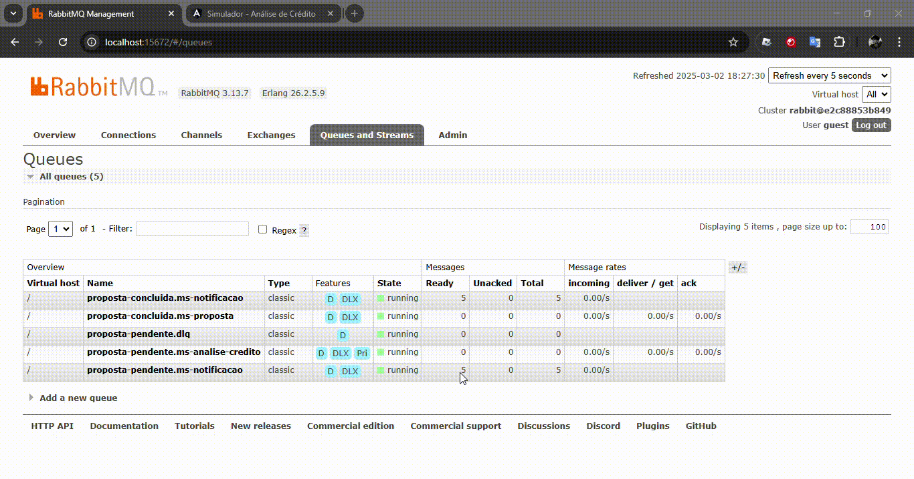
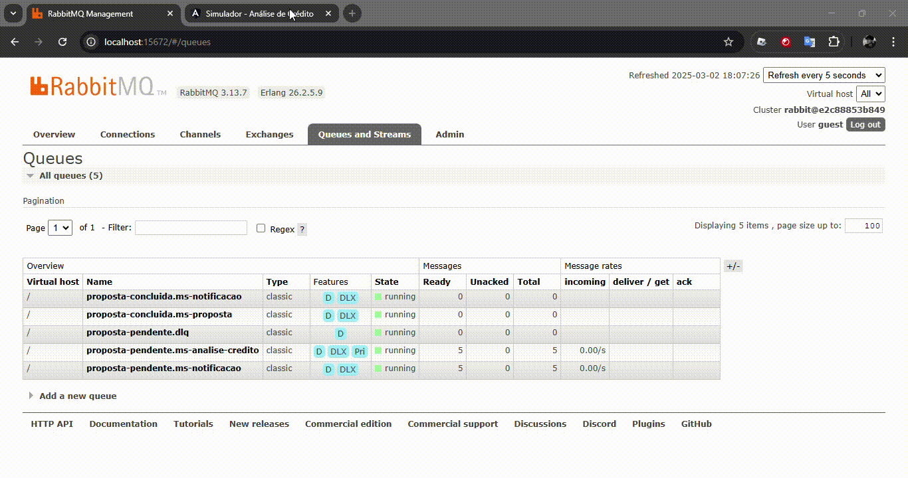
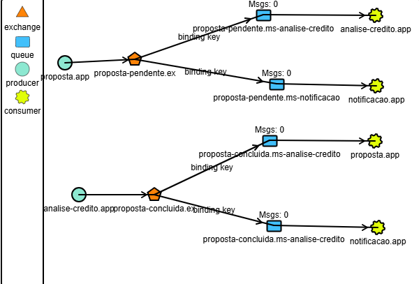

# Sistema de Propostas

O **Sistema de Propostas** é uma aplicação distribuída que permite a criação e avaliação de propostas. Um usuário cadastra uma proposta e o sistema, através de um fluxo orquestrado por microsserviços, avalia se a proposta é aprovada ou não.

## Sumário
- [Sistema de Propostas](#sistema-de-propostas)
  - [Sumário](#sumário)
  - [Visão Geral](#visão-geral)
  - [Arquitetura](#arquitetura)
  - [Microsserviços](#microsserviços)
    - [proposta-app](#proposta-app)
    - [notificacao-app](#notificacao-app)
    - [analisecredito-app](#analisecredito-app)
  - [Sumário](#sumário-1)
  - [Visão Geral](#visão-geral-1)
  - [Arquitetura](#arquitetura-1)
  - [Microsserviços](#microsserviços-1)
    - [proposta-app](#proposta-app-1)
    - [notificacao-app](#notificacao-app-1)
    - [analisecredito-app](#analisecredito-app-1)
  - [Configuração do RabbitMQ](#configuração-do-rabbitmq)
    - [Filas](#filas)
    - [Exchanges](#exchanges)
  - [Fluxograma das Filas](#fluxograma-das-filas)
  - [Tecnologias Utilizadas](#tecnologias-utilizadas)
  - [Configuração e Execução](#configuração-e-execução)
  - [Resiliência e Tratamento de Erros](#resiliência-e-tratamento-de-erros)
  - [Contato](#contato)
  - [Configuração do RabbitMQ](#configuração-do-rabbitmq-1)
    - [Filas](#filas-1)
    - [Exchanges](#exchanges-1)
  - [Fluxograma das Filas](#fluxograma-das-filas-1)
  - [Tecnologias Utilizadas](#tecnologias-utilizadas-1)
  - [Configuração e Execução](#configuração-e-execução-1)
  - [Resiliência e Tratamento de Erros](#resiliência-e-tratamento-de-erros-1)
  - [Contato](#contato-1)

## Visão Geral

O Sistema de Propostas possibilita que o usuário registre uma proposta, que em seguida é processada para verificação e avaliação de aprovação. A arquitetura modular, baseada em microsserviços, garante escalabilidade, resiliência e facilidade de manutenção.

## Arquitetura

A aplicação é dividida em três microsserviços interconectados, cada um com responsabilidades específicas:

- **proposta-app**: Núcleo da aplicação, responsável pelo cadastro e gerenciamento de propostas no banco de dados, além da exposição de endpoints para criação e consulta. Inclui um mecanismo de resiliência para garantir a continuidade do fluxo mesmo em caso de falhas no RabbitMQ.
- **notificacao-app**: Responsável pelo envio de notificações, integrando com o Amazon SNS da AWS para informar os usuários sobre o status de suas propostas.
- **analisecredito-app**: Realiza a avaliação da proposta para determinar sua aprovação ou reprovação. Utiliza padrões como Strategy para uma análise robusta e calcula pontos de maneira aleatória para definir o resultado.

## Microsserviços

### proposta-app

- **Função Principal**: Cadastro e consulta de propostas.
- **Características**:
  - Armazenamento de propostas no banco de dados.
  - Exposição de endpoints REST para criação e consulta.
  - Mecanismo de resiliência que, em caso de indisponibilidade do RabbitMQ, reenvia a mensagem a cada 10 segundos para a fila de análise de crédito, evitando perda de dados.
  - **Atualizações em Tempo Real**: Utiliza WebSocket para enviar atualizações imediatas sobre o status das propostas para os clientes conectados.
- **Demonstração**:
  

### notificacao-app

- **Função Principal**: Envio de notificações aos usuários.
- **Características**:
  - Integração com o Amazon SNS (AWS) para envio de notificações.
  - Gerenciamento e rastreamento das notificações conforme o status das propostas.
- **Demonstração**:
  

### analisecredito-app

- **Função Principal**: Avaliação e aprovação das propostas.
- **Características**:
  - Utilização de padrões de projeto, como Strategy, para oferecer uma análise robusta.
  - Cálculo de pontos de forma aleatória, determinando a aprovação ou reprovação da proposta.
- **Demonstração**:
  
  - [Sumário](#sumário)
  - [Visão Geral](#visão-geral)
  - [Arquitetura](#arquitetura)
  - [Microsserviços](#microsserviços)
    - [proposta-app](#proposta-app)
    - [notificacao-app](#notificacao-app)
    - [analisecredito-app](#analisecredito-app)
  - [Sumário](#sumário-1)
  - [Visão Geral](#visão-geral-1)
  - [Arquitetura](#arquitetura-1)
  - [Microsserviços](#microsserviços-1)
    - [proposta-app](#proposta-app-1)
    - [notificacao-app](#notificacao-app-1)
    - [analisecredito-app](#analisecredito-app-1)
  - [Configuração do RabbitMQ](#configuração-do-rabbitmq)
    - [Filas](#filas)
    - [Exchanges](#exchanges)
  - [Fluxograma das Filas](#fluxograma-das-filas)
  - [Tecnologias Utilizadas](#tecnologias-utilizadas)
  - [Configuração e Execução](#configuração-e-execução)
  - [Resiliência e Tratamento de Erros](#resiliência-e-tratamento-de-erros)
  - [Contato](#contato)
  - [Configuração do RabbitMQ](#configuração-do-rabbitmq-1)
    - [Filas](#filas-1)
    - [Exchanges](#exchanges-1)
  - [Fluxograma das Filas](#fluxograma-das-filas-1)
  - [Tecnologias Utilizadas](#tecnologias-utilizadas-1)
  - [Configuração e Execução](#configuração-e-execução-1)
  - [Resiliência e Tratamento de Erros](#resiliência-e-tratamento-de-erros-1)
  - [Contato](#contato-1)

## Visão Geral

O Sistema de Propostas possibilita que o usuário registre uma proposta, que em seguida é processada para verificação e avaliação de aprovação. A arquitetura modular, baseada em microsserviços, garante escalabilidade, resiliência e facilidade de manutenção.

## Arquitetura

A aplicação é dividida em três microsserviços interconectados, cada um com responsabilidades específicas:

- **proposta-app**: Núcleo da aplicação, responsável pelo cadastro e gerenciamento de propostas no banco de dados, além da exposição de endpoints para criação e consulta. Inclui um mecanismo de resiliência para garantir a continuidade do fluxo mesmo em caso de falhas no RabbitMQ.
- **notificacao-app**: Responsável pelo envio de notificações, integrando com o Amazon SNS da AWS para informar os usuários sobre o status de suas propostas.
- **analisecredito-app**: Realiza a avaliação da proposta para determinar sua aprovação ou reprovação. Utiliza padrões como Strategy para uma análise robusta e calcula pontos de maneira aleatória para definir o resultado.

## Microsserviços

### proposta-app

- **Função Principal**: Cadastro e consulta de propostas.
- **Características**:
  - Armazenamento de propostas no banco de dados.
  - Exposição de endpoints REST para criação e consulta.
  - Mecanismo de resiliência que, em caso de indisponibilidade do RabbitMQ, reenvia a mensagem a cada 10 segundos para a fila de análise de crédito, evitando perda de dados.
  - **Atualizações em Tempo Real**: Utiliza WebSocket para enviar atualizações imediatas sobre o status das propostas para os clientes conectados.
- **Demonstração**:
  

### notificacao-app

- **Função Principal**: Envio de notificações aos usuários.
- **Características**:
  - Integração com o Amazon SNS (AWS) para envio de notificações.
  - Gerenciamento e rastreamento das notificações conforme o status das propostas.
- **Demonstração**:
  

### analisecredito-app

- **Função Principal**: Avaliação e aprovação das propostas.
- **Características**:
  - Utilização de padrões de projeto, como Strategy, para oferecer uma análise robusta.
  - Cálculo de pontos de forma aleatória, determinando a aprovação ou reprovação da proposta.
- **Demonstração**:
  

## Configuração do RabbitMQ

A comunicação entre os microsserviços é realizada através do RabbitMQ, com a seguinte estrutura de filas e exchanges:

### Filas

- `proposta-pendente.ms-notificacao`
- `proposta-pendente.ms-analise-credito`
- `proposta-pendente-dlx` (Dead Letter Queue - DLQ)
- `proposta-concluida.ms-proposta`
- `proposta-concluida.ms-notificacao`

### Exchanges

- `proposta-concluida.ex`
- `proposta-pendente.ex`
- `proposta-pendente-dlx.ex`

Essas configurações garantem que as mensagens sejam roteadas corretamente, mantendo a integridade e resiliência do fluxo de processamento entre os serviços.

## Fluxograma das Filas

A seguir, um fluxograma ilustrativo (feito no TryRabbitMQ) apresenta a estrutura das filas utilizadas no sistema:

## Tecnologias Utilizadas

- **Java** e **Spring Boot** para desenvolvimento dos microsserviços.
- **RabbitMQ** para gerenciamento de filas e troca de mensagens.
- **Amazon SNS (AWS)** para envio de notificações.
- **WebSocket** para atualizações em tempo real das propostas.
- Padrões de projeto (ex: Strategy) para uma arquitetura robusta e escalável.

## Configuração e Execução

1. **Pré-requisitos**:
   - JDK 11 ou superior.
   - Docker (opcional, para facilitar a configuração do RabbitMQ e outros serviços).
   - Conta e configuração de acesso à AWS para uso do Amazon SNS.

2. **Configuração do RabbitMQ**:
   - Configure as filas e exchanges conforme descrito na seção [Configuração do RabbitMQ](#configuração-do-rabbitmq).
   - Assegure-se de que o RabbitMQ esteja em funcionamento antes de iniciar os microsserviços.

3. **Execução**:
   - Compile e execute cada microsserviço individualmente.
   - Verifique as configurações de conexão com o RabbitMQ e a AWS nos arquivos de configuração de cada serviço.
   - Inicie o serviço `proposta-app` para começar o cadastro de propostas e a comunicação com os demais serviços.

## Resiliência e Tratamento de Erros

O microsserviço `proposta-app` implementa um mecanismo de resiliência que, em caso de falha temporária do RabbitMQ, tenta reencaminhar a mensagem para a fila de análise de crédito a cada 10 segundos. Essa estratégia garante que nenhuma proposta seja perdida, mantendo a integridade do fluxo de dados.

## Contato

Para dúvidas, sugestões ou mais informações, entre em contato:

- **Gabriel Lima de Souza**
- **gabriellima2803@gmail.com**
- **[LinkedIn](https://www.linkedin.com/in/gabriel-limadev/)**
)

## Configuração do RabbitMQ

A comunicação entre os microsserviços é realizada através do RabbitMQ, com a seguinte estrutura de filas e exchanges:

### Filas

- `proposta-pendente.ms-notificacao`
- `proposta-pendente.ms-analise-credito`
- `proposta-pendente-dlx` (Dead Letter Queue - DLQ)
- `proposta-concluida.ms-proposta`
- `proposta-concluida.ms-notificacao`

### Exchanges

- `proposta-concluida.ex`
- `proposta-pendente.ex`
- `proposta-pendente-dlx.ex`

Essas configurações garantem que as mensagens sejam roteadas corretamente, mantendo a integridade e resiliência do fluxo de processamento entre os serviços.

## Fluxograma das Filas

A seguir, um fluxograma ilustrativo (feito no TryRabbitMQ) apresenta a estrutura das filas utilizadas no sistema:

## Tecnologias Utilizadas

- **Java** e **Spring Boot** para desenvolvimento dos microsserviços.
- **RabbitMQ** para gerenciamento de filas e troca de mensagens.
- **Amazon SNS (AWS)** para envio de notificações.
- **WebSocket** para atualizações em tempo real das propostas.
- Padrões de projeto (ex: Strategy) para uma arquitetura robusta e escalável.

## Configuração e Execução

1. **Pré-requisitos**:
   - JDK 11 ou superior.
   - Docker (opcional, para facilitar a configuração do RabbitMQ e outros serviços).
   - Conta e configuração de acesso à AWS para uso do Amazon SNS.

2. **Configuração do RabbitMQ**:
   - Configure as filas e exchanges conforme descrito na seção [Configuração do RabbitMQ](#configuração-do-rabbitmq).
   - Assegure-se de que o RabbitMQ esteja em funcionamento antes de iniciar os microsserviços.

3. **Execução**:
   - Compile e execute cada microsserviço individualmente.
   - Verifique as configurações de conexão com o RabbitMQ e a AWS nos arquivos de configuração de cada serviço.
   - Inicie o serviço `proposta-app` para começar o cadastro de propostas e a comunicação com os demais serviços.

## Resiliência e Tratamento de Erros

O microsserviço `proposta-app` implementa um mecanismo de resiliência que, em caso de falha temporária do RabbitMQ, tenta reencaminhar a mensagem para a fila de análise de crédito a cada 10 segundos. Essa estratégia garante que nenhuma proposta seja perdida, mantendo a integridade do fluxo de dados.

## Contato

Para dúvidas, sugestões ou mais informações, entre em contato:

- **Gabriel Lima de Souza**
- **gabriellima2803@gmail.com**
- **[LinkedIn](https://www.linkedin.com/in/gabriel-limadev/)**
